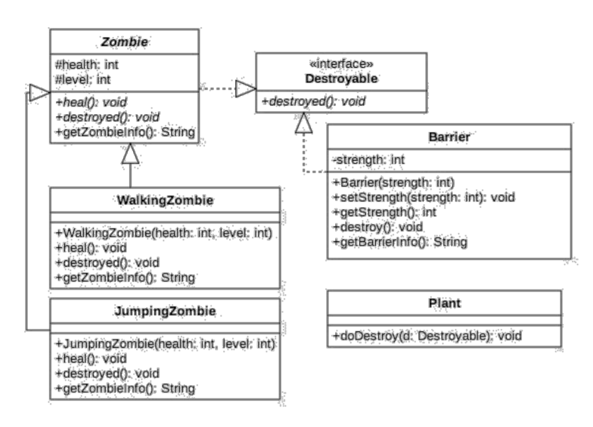

### Praktikum PBO 11
This is the eleventh repository from PBO Practice in State Polytechnic of Malang. It is coded with Java Programming language. implements Polymorphism Concept from given class diagram in Jobsheet.

- 📝 Pdf filename :[2C_24_Yudas Malabi.pdf](https://github.com/Yudas1337/Praktikum_PBO_11/blob/master/2C_24_Yudas%20Malabi.pdf)

### Main Topic : Overloading and Overriding
### Class Diagram : 

### Class Structure For Overloading :
<ul>
  <li>Barrier : Representing Barrier class that implement Destroyable</li>
  <li>Destroyable : Representing interface class</li>
  <li>JumpingZombie : Representing JumpingZombie class that inherit Zombie class</li>
  <li>Plant : Representing Plant class</li>
  <li>Tester : Representing Tester class as a main class</li>
  <li>WalkingZombie : Representing WalkingZombie class with inherit from Zombie</li>
  <li>Zombie : Representing Zombie abstract class with implement Destroyable</li>
</ul>

### Technologies :
<ul>
<li>Java Object Oriented Programming</li>
<li>IDE : Visual Studio Code with java plugins for compiler</li>
</ul>

### Credits : Yudas Malabi 😄✌️
